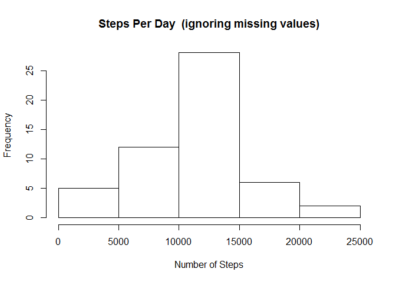
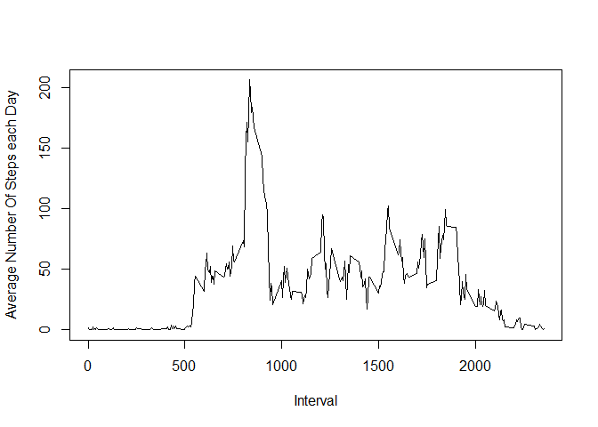
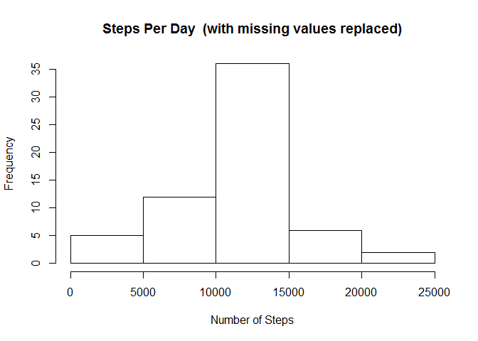
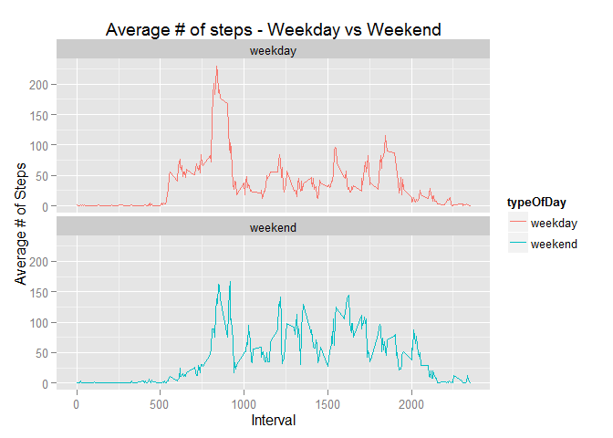

# Reproducible Research: Peer Assessment 1

The data for this assignment is stored in a file called Activity.Zip.   It can be found at the same GitHub location as this file or
by clicking on this [link](https://github.com/alextil/RepData_PeerAssessment1). 

The variables included in this dataset are:

  • steps: Number of steps taking in a 5-minute interval (missing values are coded as  NA )


  • date: The date on which the measurement was taken in YYYY-MM-DD format


  • interval: Identifier for the 5-minute interval in which measurement was taken

Note : some parts of this analysis require the use of the libraries dplyr and ggplot2

## Loading and preprocessing the data

The dataset is stored in a comma-separated-value (CSV) file and there are a total of 17,568 observations in this dataset.


```r
rawData <- read.csv("activity.csv")
```

Let's do a summary of the data to see what we have.


```r
summary(rawData)
```

```
##      steps                date          interval     
##  Min.   :  0.00   2012-10-01:  288   Min.   :   0.0  
##  1st Qu.:  0.00   2012-10-02:  288   1st Qu.: 588.8  
##  Median :  0.00   2012-10-03:  288   Median :1177.5  
##  Mean   : 37.38   2012-10-04:  288   Mean   :1177.5  
##  3rd Qu.: 12.00   2012-10-05:  288   3rd Qu.:1766.2  
##  Max.   :806.00   2012-10-06:  288   Max.   :2355.0  
##  NA's   :2304     (Other)   :15840
```

The summary of the data reveals that there are a number of NA's in the dataset.  We will not do any pre-processing to clean these up at this stage. 

## What is mean total number of steps taken per day?

Calculate the total number of steps taken per day


```r
stepsTotalPerDay <- aggregate(steps ~ date, data = rawData, FUN = sum)
```

Make a histogram of the total number of steps taken each day


```r
hist(stepsTotalPerDay$steps,xlab="Number of Steps",main="Steps Per Day  (ignoring missing values)")
```

 

Ignoring the NA's for now, calculate and report the mean and median total number of steps taken per day.  


```r
rawMean<-mean(stepsTotalPerDay$steps,na.rm=TRUE)

rawMedian<-median(stepsTotalPerDay$steps,na.rm=TRUE)

sprintf("Mean=%s Median=%s",rawMean,rawMedian)
```

```
## [1] "Mean=10766.1886792453 Median=10765"
```

## What is the average daily activity pattern?

Make a time series plot (i.e. type = "l") of the 5-minute interval (x-axis) and the average number of steps taken, averaged across all days (y-axis)


```r
## use aggregate to create a new data frame that contains the average number of steps per interval 
stepsPerInterval <- aggregate(steps~interval,data=rawData,FUN=mean)
## now plot the data using the base plot method
plot(stepsPerInterval,type="l",xlab="Interval",ylab="Average Number Of Steps each Day")
```

 

Which 5-minute interval, on average across all the days in the dataset, contains the maximum number of steps?


```r
## we want to find the data frame interval vector that contains the maximum mean value for number of steps
stepsPerInterval$interval[which.max(stepsPerInterval$steps)]
```

```
## [1] 835
```

Based on the plot we know we should see an interval value that lies between 500 and 1000 - which 835 does


## Imputing missing values

Calculate and report the total number of missing values in the dataset (i.e. the total number of rows with NAs)


```r
sum(is.na(rawData))
```

```
## [1] 2304
```

Based on the earlier summary we expect to see 2304 NA's , all of which are in the steps field.

As we have a dataset containing the mean for each 5-minute interval I will replace any missing values with the mean for that interval


```r
## merge the raw data and the data frame containing the intervals 
## I'm sure there's a better way to do this using dplyr or another package but I haven't been able to work it out. 

mergedData <- merge(rawData,stepsPerInterval,by="interval",suffixes=c("","_mean"))
naItems <- is.na(mergedData$steps)
mergedData$steps[naItems] <- mergedData$steps_mean[naItems] 
```


Create a new dataset that is equal to the original dataset but with the missing data filled in.


```r
# retrive the first three columns as a final data set 
cleanData <- mergedData[,c(1:3)]
summary(cleanData)
```

```
##     interval          steps                date      
##  Min.   :   0.0   Min.   :  0.00   2012-10-01:  288  
##  1st Qu.: 588.8   1st Qu.:  0.00   2012-10-02:  288  
##  Median :1177.5   Median :  0.00   2012-10-03:  288  
##  Mean   :1177.5   Mean   : 37.38   2012-10-04:  288  
##  3rd Qu.:1766.2   3rd Qu.: 27.00   2012-10-05:  288  
##  Max.   :2355.0   Max.   :806.00   2012-10-06:  288  
##                                    (Other)   :15840
```

The summary confirms we now have no missing values. 

Make a histogram of the total number of steps taken each day


```r
stepsTotalPerDayClean <- aggregate(steps ~ date, data = cleanData, FUN = sum)

hist(stepsTotalPerDayClean$steps,xlab="Number of Steps",main="Steps Per Day  (with missing values replaced)")
```

 


Calculate and report the mean and median total number of steps taken per day.

```r
cleanMean<-mean(stepsTotalPerDayClean$steps)

cleanMedian<-median(stepsTotalPerDayClean$steps)

sprintf("Mean=%s Median=%s",cleanMean,cleanMedian)
```

```
## [1] "Mean=10766.1886792453 Median=10766.1886792453"
```

Do these values differ from the estimates from the first part of the assignment?


```r
sprintf("Original Mean=%s Revised Mean=%s  : Difference %s",rawMean,cleanMean,abs(rawMean-cleanMean))
```

```
## [1] "Original Mean=10766.1886792453 Revised Mean=10766.1886792453  : Difference 0"
```

```r
sprintf("Original Median=%s Revised Median=%s : Difference :%s",rawMedian,cleanMedian,abs(rawMedian-cleanMedian))
```

```
## [1] "Original Median=10765 Revised Median=10766.1886792453 : Difference :1.1886792452824"
```

The impact of imputing missing data on the estimates of the total daily number of steps using the mean of the daily interval appears to be negligable?


## Are there differences in activity patterns between weekdays and weekends?

Create a new factor variable in the dataset with two levels – “weekday” and “weekend” indicating whether a given date is a weekday or weekend day


```r
## create a function to identify weekend days (day number 6 or 7 returned by strftime)
isweekend <- function(x) {
  if (strftime(as.Date(x),"%u") %in% c("6","7"))
  { 
    "weekend" 
  }else{
    "weekday"
  }
}

## add a new vector to the data frame using this function 
cleanData$typeOfDay <- as.factor(sapply(cleanData$date,isweekend))
```

Make a panel plot containing a time series plot (i.e. type = "l") of the 5-minute interval (x-axis) and the average number of steps taken, averaged across all weekday days or weekend days (y-axis).


```r
library(dplyr)
```

```
## 
## Attaching package: 'dplyr'
## 
## The following object is masked from 'package:stats':
## 
##     filter
## 
## The following objects are masked from 'package:base':
## 
##     intersect, setdiff, setequal, union
```

```r
library(ggplot2)
## group the data by type of day - kudos to BBrill on stack overflow for a pointer in 
## the right direction 
par(mfrow=c(2,1))

plotData <- cleanData %>% 
    group_by(interval, typeOfDay) %>%
        summarise(avgSteps=mean(steps))


ggplot(plotData, aes(x=interval,y=avgSteps,color=typeOfDay),facets=.~typeOfDay) + geom_line() + facet_wrap(~typeOfDay,ncol=1) + ggtitle("Average # of steps - Weekday vs Weekend")  + labs(x="Interval",y="Average # of Steps")  
```

 

It appears there is some correlation between weekday and weekend activity but one of the noticable differences is that activity during weekday 'working' hours (i.e. 9am to 5pm) is lower than that of weekends.  


